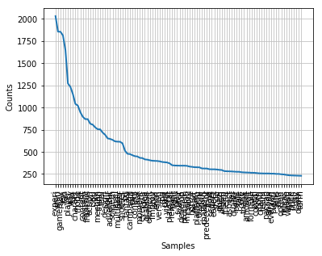

# 게임 리뷰 토픽 모델링과 감정 분석
## Purpose
- ### 게임 제품의 사용자 리뷰가 어떤 주제로 이루어졌는가?
- ### 각 주제는 어떤 감정(긍/부정)을 지니고 있는가?
- ### 여러 게임들 각각의 주제와 감정 정도를 측정하여 보여줄 수 있도록 하기

* ## 순서
  1. #### 데이터 수집
  2. #### 토픽 모델링
  3. #### 감정 분석
  4. #### 분석 결과

* ## 폴더 설명
  * #### data_scrap : how to collect review data from metacritic.com
  * #### topic_modeling : topic modeling with LDA and word2vec
  * #### sentiment_analysis : sentiment scoring for each topic

## 1. Data Scrap
  ### scrap data from metacritic.com

## 2. Topic modeling
  ### 2.1 topic modeling using LDA
  #### Use NLTK, Sklearn
  #### 각 게임 제품 리뷰가 어떤 주제들로 구성되어있을까?
  - #### 토픽 생성을 위한 과정
    1. #### 기본 전처리 과정
      - #### 토큰화
        <pre><code> nltk.tokenize.sent_tokenize() </pre></code>
      - #### stemming
        nltk의 SnowballStemmer 사용
      - #### stop words 제거
        기본 stop words list에 추가로 제거할 단어 입력
       <pre><code>stop=nltk.corpus.stopwords.words('english') # basic stop words list
       stop+=["!","...",")","(","/",".",",","?","-","''","``","'d",":",";","***","*","%","$","@","#","&","+","~","'s","n't","'m","'d"] # puntuation, symbols
       additionalstop = ['game','make','un', 'es', 'juego', 'la', 'el', 'con', 'lo', 'los', 'para', 'una', 'si', 'se', 'por', 'le'] #해석불가한 단어들
       gametitle # 게임 제목
       stop+= additionalstop
       stop+= gametitle       
       </pre></code>

       - #### 길이, 빈도 기반 단어 제거
        - 길이가 1인 단어 제거
        - 단어 분포 확인 후 빈도가 낮은 단어 제거

        
        
